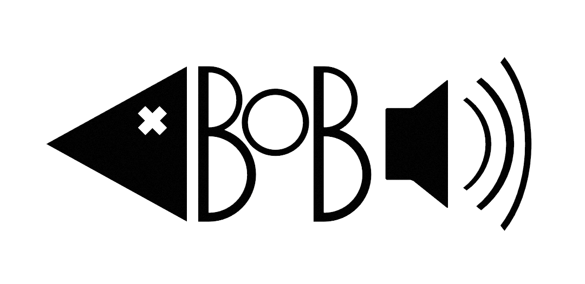

<div align="center">



<h1>BoB</h1>
<em>Blinka och Blända</em>

<a href="#running">Running</a> | <a href="./api/bob.h">bob.h</a>


Blinka och Blända is an audio visualizer.
</div>

## Prerequisites:
* Zig compiler (0.13.0)

## Running
```shellsession
git clone https://github.com/pvk24-16/bob
cd bob
zig build run
```

## Creating visualization
BoB is essentially a fancy dynamic library loader. A visualization is a dynamic library. That is, a `.dll` file on Windows, a `.so` file on Linux and a `.dylib` file on macOS respectively.

You, the developer, must implement four functions. Namely: `get_info()`, `create()`, `update()` and `destroy()`. An example is available under `examples/zig-template`.

The API is defined as a C header in `api/bob.h` and contains all necessary functions to fetch audio data and analysis results.

Since the API is defined as a C header, there are few restrictions to what language you may use to implement a visualizer. The important thing is that the mandatory functions are exported. In Zig, simply use the `export` keyword. In C, the following macro may be suitable:

```
#ifdef WIN32
    #define EXPORT __declspec(dllexport)
#elif defined(__GNUC__) || defined(__clang__)
    #define EXPORT __attribute__((visibility("default")))
#else
    #define EXPORT
#endif
```

The `get_info()` function must return a `bob_visualizer_info` which contains the visualizer name, description and analyses to enable.

The `create()` function may return arbitrary user data, otherwise `null`. This function is called once and may be used to initialize objects and data.

The `update()` function is called every frame and is used to update the visualization state.

The `destroy()` function is called once when the visualization is shutdown. This function may be used to clean up allocations and similar resources.

Finally, after compiling the shared object, place it in `zig-out/bob/NAME/libNAME`. It is important that the folder and library name is the same in the current implementation. After running BoB, the visualizer should be visible in the "Select visualizer" drop-down menu.

If you wish to use the Zig build system to build your C implementations, see `examples/build_c_examples.zig`. There are many example build scripts for compiling Zig implementations, `examples/logvol/build.zig` is a good place to start.